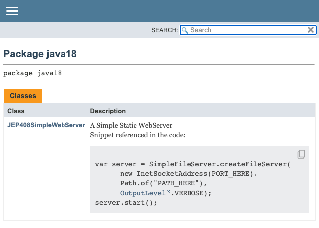

# JEP 413: Code Snippets in Java API Documentation

See code of `JEP408SimpleWebServer`

- To get this example to work for the snippet javadoc

```shell
$ javadoc --snippet-path . -d doc JEP408SimpleWebServer.java
$ jwebserver -b 0.0.0.0 -p 8000
```

- open http://localhost:8000/doc



